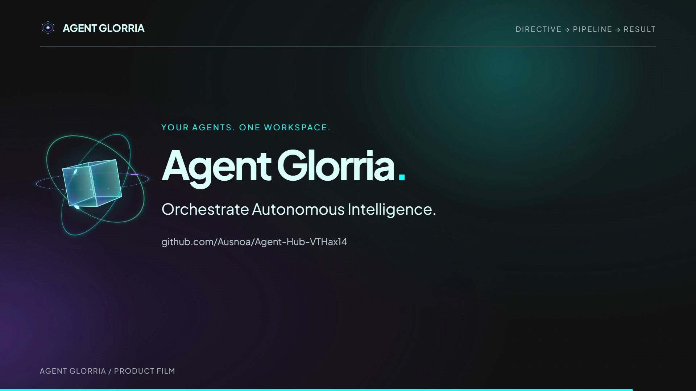

# Agent Glorria launch video

[Watch the 22-second video](brag.mp4)



Source-based UI recreation: operational directive → three-agent pipeline → executive synthesis. The result scene is explicitly an illustrative offline supplied-notes demo, not a live execution recording. No application behavior was changed.

The enhanced cut adds glass panels with traveling highlights, a rotating 3D glass nucleus with satellite rings, perspective card entrances, handoff pulses, and a topology graph derived from the Stitch discovery mesh in `src/components/agent-hub/topology-graph.tsx`. Effects are editable in `composition/effects.css` and `composition/effects.js`.

## Re-render

Requires Node.js 22+, Chrome, and FFmpeg/FFprobe on PATH.

```sh
cd brag-output/composition
npm run check
npm run render -- --quality delivery --workers 1 --output ../brag.mp4
```

The CLI is pinned to Hyperframes 0.8.52. Fonts, logo, animation runtime, and edited audio are local. `index.html` contains the seekable timeline. Poster extraction uses the 3D closing scene at 20 seconds. The delivered MP4 has that poster baked into frame zero.

## Credits

Created with the [/brag skill](https://github.com/latent-spaces/brag) and [Hyperframes](https://github.com/heygen-com/hyperframes).

Current soundtrack: **Clarity (feat. Foxes)** by Zedd, from the user-supplied audio file. The excerpt starts at source 0:47; the requested source 1:05 drop lands exactly at video 0:18, the Agent Glorria closing reveal. The excerpt fades out over the final 1.2 seconds. This track is not covered by the earlier CC BY music license.

The current cut omits the earlier sound effects so the music drop is clear. Earlier music and effects remain as unused source assets.

Plus Jakarta Sans: SIL Open Font License, included in `composition/assets/OFL.txt`. GSAP 3.14.2: copyright GreenSock, [standard license](https://gsap.com/standard-license); original license header retained. Agent Glorria emblem comes from this repository.


