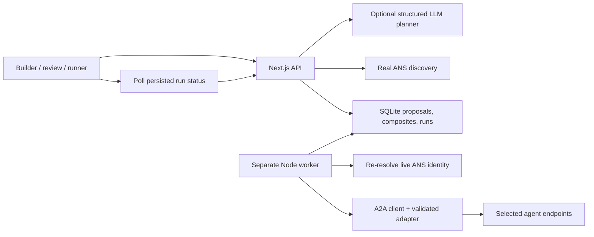

# Implemented architecture

## Request flow

`POST /api/proposals` combines planning and discovery into one reviewable, server-stored proposal. This consolidates the separate planning/discovery calls proposed in the initial PRD. Live directory browsing still uses `POST /api/discover` independently.

`POST /api/agents` accepts only a proposal identifier and copies the reviewed server-side definition into an immutable version-one composite, including its form configuration. It rejects incomplete or expired proposals. Extra client-supplied endpoints do not become executable configuration.

`POST /api/agents/:id/invoke` validates the input and persists a queued run. It does not rely on a web request continuing after a response. The worker claims the run, persists every attempt, and executes steps in sequence. `GET /api/runs/:id` exposes the trace; retry requeues only a failed run.

## Data and adapter scope

Each step receives original input, previous output, and the accumulated results. The supported report contains the company, observations, risk signals, summary, sources, and an explicit fixture marker. The first adapter requires supplied company notes. Downstream adapters consume the structured report rather than trying arbitrary schema translation.

Forms are rendered from a fixed, typed UI configuration. No arbitrary React code is generated.

## Real versus local

ANS queries are real. Local demo services use real A2A messages and separate processes, but deterministic transformations of supplied notes. They are never presented as ANS discoveries or live research. No live composition substitutes them for missing registry candidates.

Live candidates require a configured compatibility allowlist, a matching skill, the supported protocol version, and a matching card endpoint. Execution re-resolves the registered identity. Cryptographic identity verification is not implemented, and the UI displays that limitation.

## Deployment boundary

The app binds to loopback and its API rejects nonlocal Host headers. Persistent files and worker leases assume one host. A public deployment needs an explicit authentication, hosting, and durable-storage design; pointing the current app at a public hostname is intentionally insufficient.

The worker uses a two-minute renewable lease. After a crash and lease expiry, a replacement worker marks interrupted runs failed. Retrying an uncertain external step can repeat its action; current supported fixtures only transform input, and live adapters must be reviewed for retry semantics before allowlisting.
